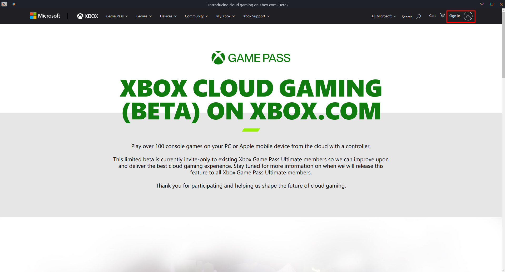
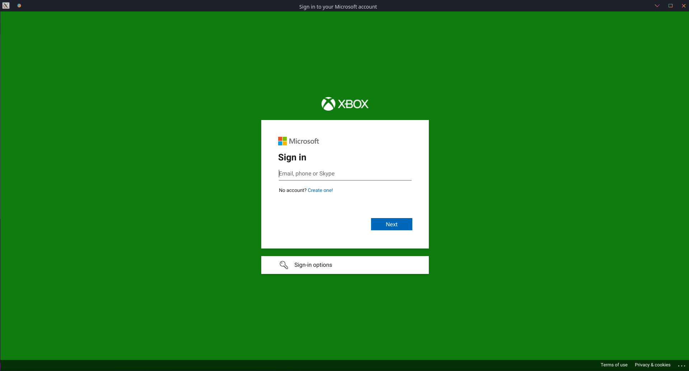
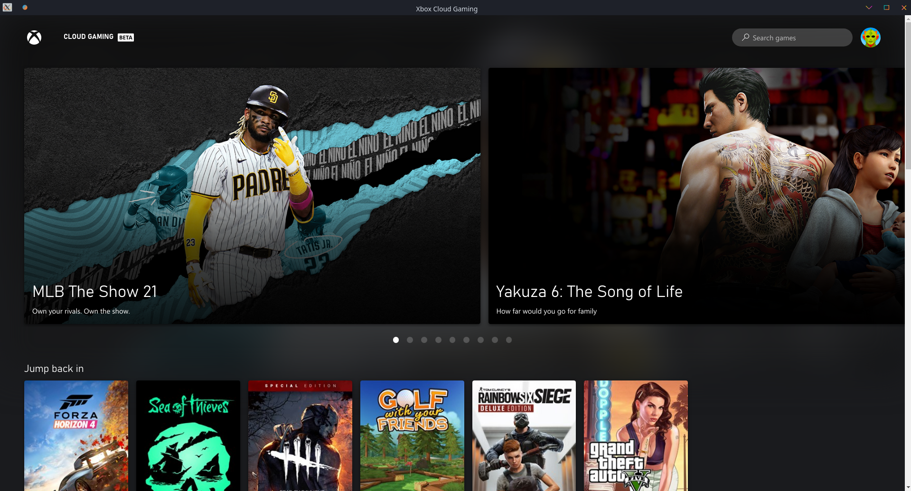

# Xbox Cloud Gaming Electron App
This electron app allows for use of the xbox cloud gaming service on linux.

## How to install
* Make sure **npm** package is installed with your distribution. 
* Open terminal in directory where you downloaded the git repo and run **npm install**
* Wait for command to run then execute **npm start** to open electron app

## How to use
* When electron app is running, hit sign in on the top right corner

* Login using with a microsoft account with access to Xbox Game Pass Ultimate and Cloud Gaming

* Enjoy access to Xbox Cloud Gaming

## Notes
* Although you can navigate the menus with a keyboard and mouse you rquire a controller to the play the games themselves.

## Credits
based on [Hou-dev](https://github.com/Hou-dev)'s [Geforce Now electron app](https://github.com/Hou-dev/geforce-now)
